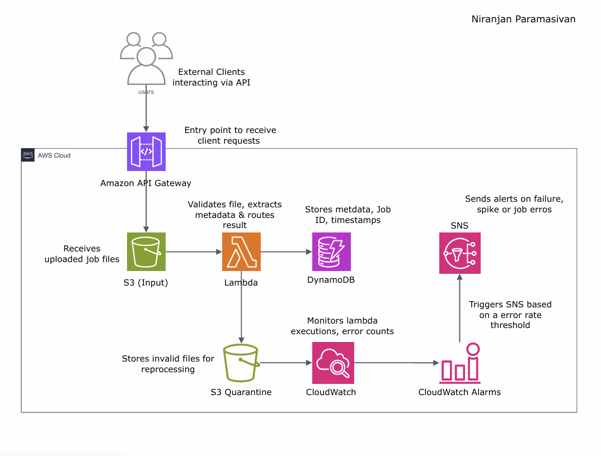

# Silent Scalper - Serverless File Validation and Processing Pipeline

Silent Scalper is a fully serverless, event-driven architecture built on AWS to automate the validation, classification, and storage of uploaded job files. It provides instant scalability, eliminates idle compute costs, and ensures fault tolerance using modern AWS services like Lambda, API Gateway, S3, DynamoDB, CloudWatch, and SNS.

---

## 🚀 Use Case

Designed to solve two critical problems in cloud-native data processing:

1. **Wasted spend from idle servers**  
2. **Crashes and timeouts under unpredictable load spikes**

Silent Scalper responds to incoming job files in real-time, processes and validates them, stores results securely, and raises alerts when necessary — all with zero manual intervention and no persistent servers.

---

## 🧱 Architecture Overview

 <!-- replace with your diagram path -->

### 🧑‍💻 User Interaction
- Users submit job files (e.g., `.json`, `.csv`) through an exposed RESTful API (via API Gateway).

### 📥 Input & Trigger
- Files are uploaded to an **S3 Input Bucket**.
- On upload, an event is triggered to launch a **Lambda function** for processing.

### ⚙️ Processing Logic
- The Lambda function:
  - Validates the file (format, schema, content)
  - If valid: extracts metadata and writes it to **DynamoDB**
  - If invalid: routes it to a **Quarantine S3 Bucket**

### 🧾 Monitoring & Logging
- **Amazon CloudWatch** tracks execution time, error rates, and logs for the Lambda function.
- **CloudWatch Alarms** are configured to detect issues like high failure rate or slow processing.

### 📢 Notifications
- **Amazon SNS** triggers real-time alerts to Slack/email in the event of abnormal behavior or failed processing.

---

## 🧰 Technologies Used

| Service         | Purpose |
|-----------------|---------|
| **Amazon S3**         | Input storage and quarantine bucket |
| **AWS Lambda**        | Core validation and processing engine |
| **Amazon API Gateway**| Public interface for file submission |
| **Amazon DynamoDB**   | Stores metadata, file status, and timestamps |
| **Amazon SNS**        | Failure alerts (Slack/email/SMS) |
| **Amazon CloudWatch** | Logs, custom metrics, and alarm conditions |

---

## 📊 Cloud Architecture Diagram Components

| Component | Description |
|----------|-------------|
| **API Gateway** | Accepts file submissions and triggers processing |
| **Input S3 Bucket** | Receives new job files from clients |
| **Lambda Function** | Validates file structure and content |
| **Quarantine Bucket** | Stores invalid, malformed, or unprocessable files |
| **DynamoDB** | Saves validated metadata (e.g., job ID, filename, timestamp, status) |
| **CloudWatch Logs & Metrics** | Tracks Lambda performance and failure counts |
| **CloudWatch Alarm** | Triggers when error thresholds are exceeded |
| **SNS Topic** | Sends alerts to subscribed endpoints (e.g., Slack or email) |

---

## 🔁 Quarantine File Reprocessing (Optional Extension)

Files that land in the quarantine bucket can be reprocessed in the following ways:
- Manually trigger reprocessing via a secured API endpoint
- Use a scheduled Lambda (via EventBridge rule) to reattempt validation every X hours
- Tag files with retry counts to avoid infinite loops

---

## ✅ Benefits

- **Serverless**: No infrastructure to manage
- **Auto-Scaling**: Reacts instantly to workload spikes
- **Fault Tolerant**: Invalid files are safely isolated
- **Observable**: Monitored using CloudWatch and alerts through SNS
- **Secure**: IAM roles ensure least-privilege access across services

---

## 📦 Folder Structure (if implemented)

```
.
├── assets/
│   └── silent-scalper-architecture.png
├── lambdas/
│   └── validateAndProcess.js
├── terraform/ or cdk/
│   └── (optional IaC setup)
├── README.md
```

---

## 📌 Future Enhancements

- Add **Step Functions** for complex workflows (enrichment, cleanup)
- Implement **Athena** or **QuickSight** for visual job processing insights
- Integrate **Cognito or API Key Auth** for protected endpoints
- Add **DLQ (SQS)** for Lambda to retry failed events before quarantine

---

## 💬 License

This project is for educational and demonstration purposes. Customize and deploy at your own discretion.
