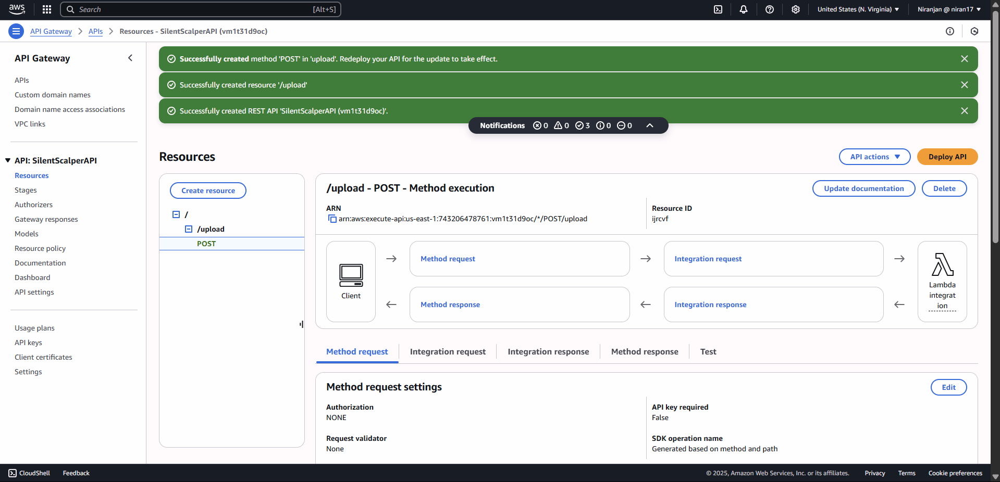
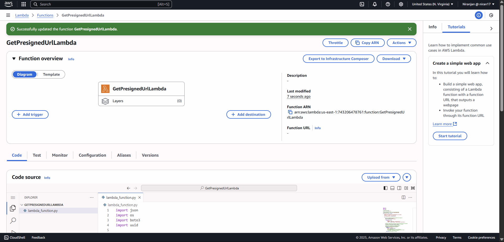
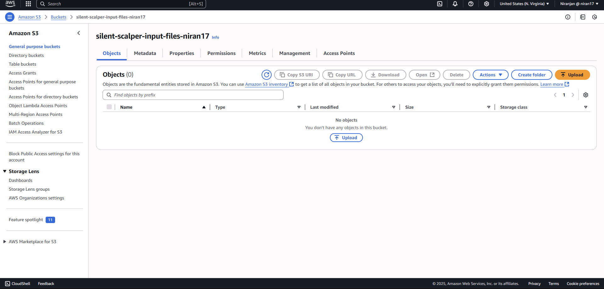
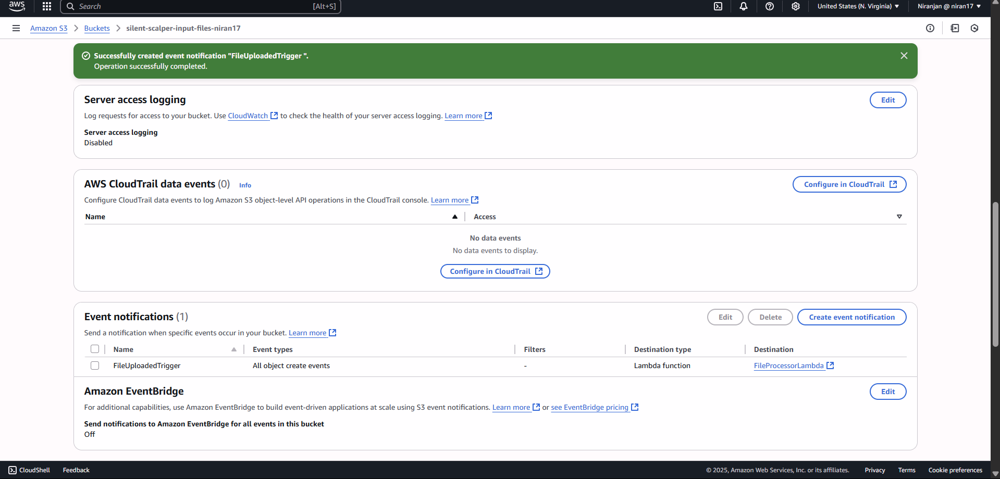
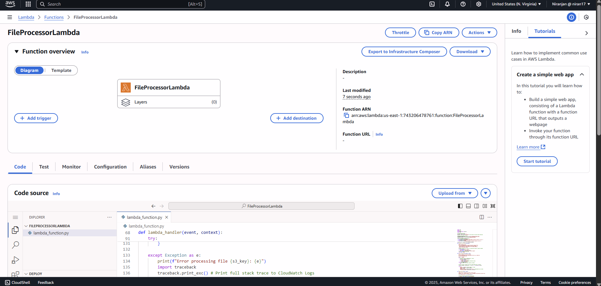
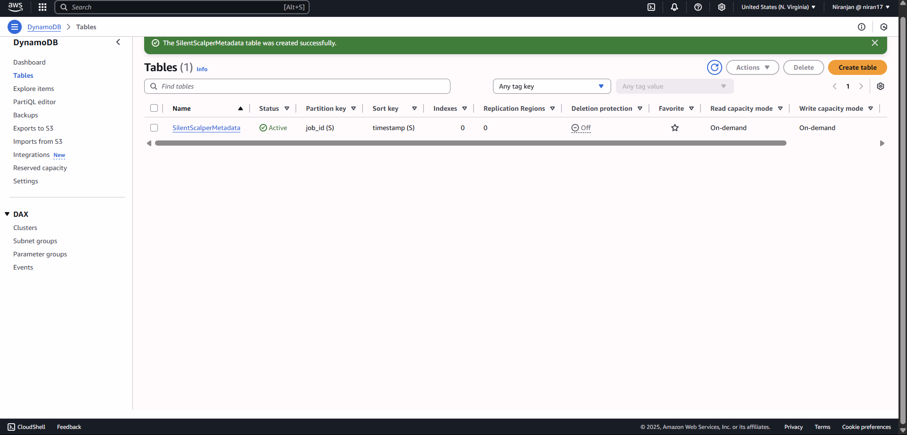
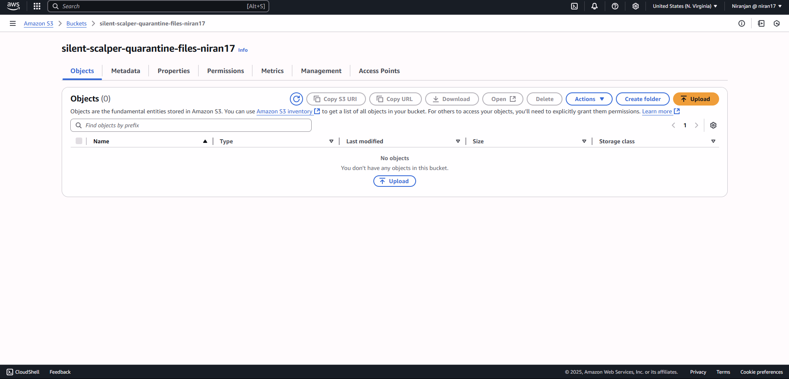
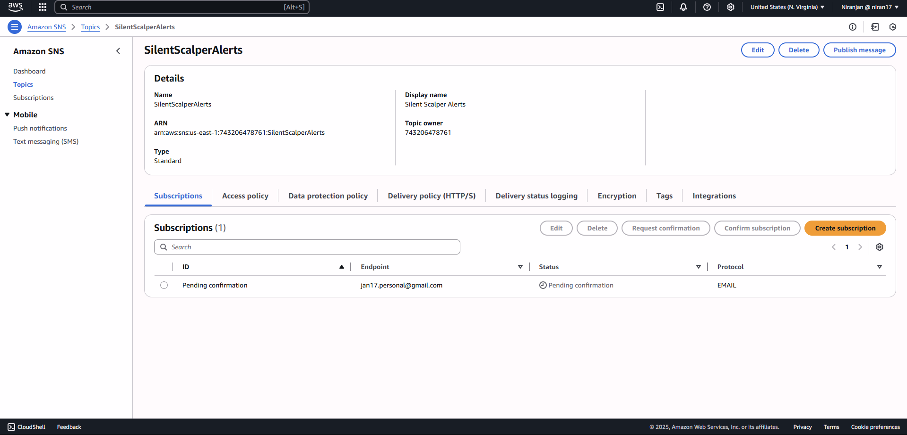

# 🧪 Silent Scalper – Serverless File Validation and Processing Pipeline

Silent Scalper is a fully serverless, event-driven architecture built on AWS to automate the validation, classification, and secure storage of uploaded job files. It enables auto-scaling, zero idle compute cost, and robust monitoring using services like Lambda, API Gateway, S3, DynamoDB, SNS, and CloudWatch.

---

## 🚀 Workflow Summary

### ✅ Step-by-Step Execution Flow

1. **📨 Client Request**:  
   External clients interact with the API via **Amazon API Gateway** to initiate a file upload.
   

3. **🔑 Pre-signed URL Generation**:  
   API Gateway triggers a **Lambda function** which generates a secure **pre-signed URL** to upload files directly to an **S3 Input bucket**.
   

5. **📤 Direct File Upload**:  
   Clients use the pre-signed URL to **upload the job file** (e.g., `.json`, `.csv`) to the S3 bucket.
   
   
7. **📦 File Processing Trigger**:  
   The **S3 "Object Created" event** triggers another **Lambda function** to begin processing.
   


9. **✅ File Validation & Metadata Extraction**:  
   - Validates the file type and structure.
   - Extracts metadata (e.g., job ID, timestamp).
   - Logs important events.
   

10. **📄 Metadata Storage**:  
   All metadata is stored in a **DynamoDB table** for tracking.
   


12. **🚫 Invalid File Quarantine**:  
   If validation fails, the file is moved/copied to a **Quarantine S3 Bucket** for future analysis.
   


14. **📊 Monitoring & Alerts**:  
   - **CloudWatch Logs** track execution details and failures.
   - **CloudWatch Alarms** trigger **SNS notifications** for critical issues.
   

---

## 🗂️ Folder Structure

```
/Silent_Scalper/
├── assets/
│   └── screenshots and architecture diagrams
├── lambda/
│   ├── presigned_url.py
│   └── fileprocessor.py
├── terraform/
    ├── main.tf
    ├── variables.tf
│   └── outputs.tf (optional IaC setup)
└── README.md
```

---

## 📐 Architecture Diagram


---

## 🔧 AWS Services Used

| Service         | Purpose |
|-----------------|---------|
| **Amazon S3**         | Input + Quarantine storage |
| **Amazon API Gateway**| Entry point for upload requests |
| **AWS Lambda**        | Generates pre-signed URLs & processes files |
| **Amazon DynamoDB**   | Stores extracted metadata and statuses |
| **Amazon CloudWatch** | Logs and monitors Lambda executions |
| **Amazon SNS**        | Sends alerts on processing failure or alarms |

---

## 📌 Benefits

- **Serverless**: No infrastructure to manage
- **Scalable**: Handles thousands of files on demand
- **Secure**: IAM-scoped access, no direct file handling
- **Observable**: Fully monitored with alarms and alerts
- **Modular**: Easily extendable with Step Functions, DLQs, or retry logic

---

## 🔮 Future Additions

- Add **EventBridge** for periodic reprocessing of quarantined files
- Use **Athena + QuickSight** for dashboarding job results
- Integrate **Cognito** for upload authorization
- Add **SQS DLQ** before Lambda to capture failed file events

---

## 📄 License

MIT – use, modify, and deploy freely for education or production.
